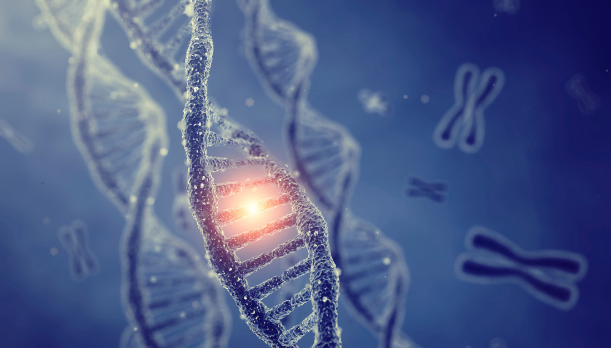
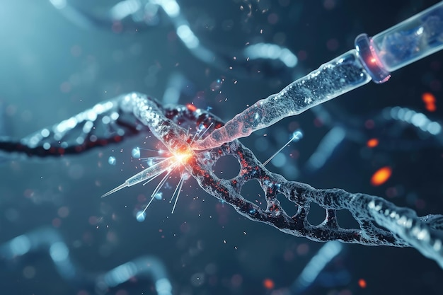
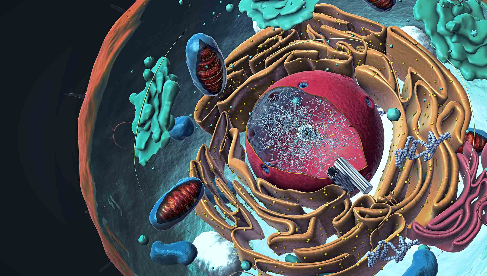

# Research Overview

Cell-cell communication (CCC) is fundamental to the functioning of multicellular organisms. Understanding CCC is crucial for deciphering the complex phenotypes and diseases that manifest at cellular, tissue, and organismal levels. Despite its significance, exploring the broader implications of functional CCC across multiple biological scales remains a major challenge in both basic and applied biomedical research.

My laboratory aims to address these challenges by developing and applying advanced machine learning and deep learning models. Leveraging the vast amounts of single-cell transcriptomic and spatial data, we aim to deepen our understanding of CCC, brain-immune crosstalk, and genotype-phenotype integration. By making these insights accessible across a wide range of biological contexts and applications, we will accelerate the discovery of novel intercellular and inter-organ therapies, opening new avenues for therapeutic innovation.

## Our Research Focus

### 1. Deciphering Cell-Cell Communication and Its Biological Implications

<!---->

We will develop computational methods to analyze functional cell-cell communication within tissues and its implications for cellular states, spatial organization, and genetic regulation. By decoding these interactions, we aim to uncover the key mechanisms that govern tissue function and organization.

### 2. Investigating the Brain-Immune-Organ Crosstalk

<!---->

Our focus will be on the role of barriers, such as the blood-brain barrier, in mediating communication between the central nervous system and peripheral immune systems. We will also explore brain-organ crosstalk through the peripheral immune system. By studying these interactions, we aim to reveal the molecular and cellular mechanisms that maintain homeostasis and contribute to disease development.

### 3. Decoding Disease Complexity through Multimodal Deep Learning

<!---->

We will integrate intercellular and inter-organ communication data with multi-layered datasets—from genotype to phenotype—using multimodal deep learning models. This approach will enhance our ability to diagnose diseases, classify disease subtypes, and identify novel therapeutic targets.

<!--## Funding

Our research is generously supported by grants from:
- National Institutes of Health (NIH)
- National Science Foundation (NSF)
- American Cancer Society
- Howard Hughes Medical Institute (HHMI)
- Department of Energy (DOE)-->
