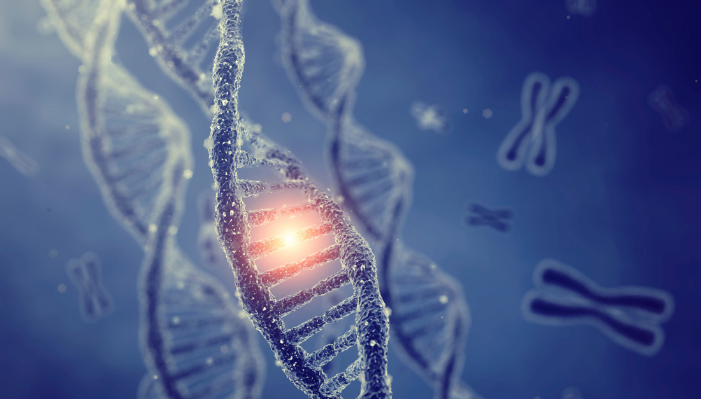
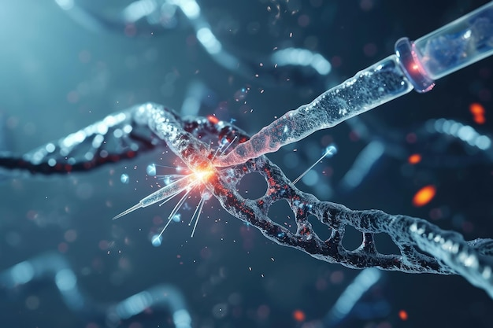
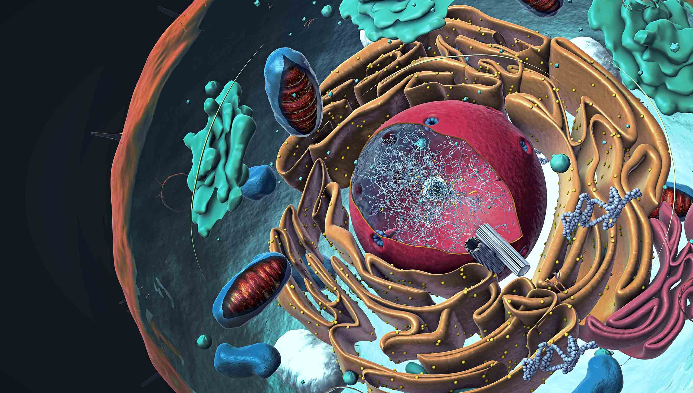

# Our Research

Our laboratory focuses on exploring the intersection of molecular biology and computational approaches to understand complex biological systems.

## Current Research Areas

### Epigenetic Regulation in Cancer

We investigate how epigenetic modifications influence gene expression patterns in various cancer types. Using cutting-edge sequencing technologies combined with computational analysis, we aim to identify novel epigenetic signatures that could serve as biomarkers or therapeutic targets.

Key projects include:
- Mapping histone modification landscapes across primary tumors
- Investigating the role of DNA methylation in therapy resistance
- Developing machine learning approaches to predict cancer progression from epigenetic data

### CRISPR Technology Development

Our lab is at the forefront of developing novel CRISPR-based tools for precise genome editing. We aim to improve the specificity, efficiency, and versatility of existing CRISPR systems through both experimental and computational approaches.

Current projects focus on:
- Engineering enhanced Cas9 variants with reduced off-target effects
- Developing methods for targeted epigenetic editing
- Creating high-throughput screening platforms for functional genomics

### Systems Biology of Cell Signaling

We apply systems biology approaches to understand how cells integrate multiple signaling inputs to make fate decisions. Using a combination of single-cell analysis, proteomics, and mathematical modeling, we study how signaling networks adapt to environmental changes.

Our research in this area includes:
- Quantitative analysis of signaling dynamics at the single-cell level
- Modeling cross-talk between stress response pathways
- Investigating the impact of environmental factors on cellular decision-making

## Research Facilities

Our laboratory is equipped with state-of-the-art facilities for molecular biology, genomics, and computational analysis:

- Next-generation sequencing platform
- Advanced microscopy suite for live-cell imaging
- High-performance computing cluster for data analysis
- Genome editing workstation
- Proteomics analysis equipment

## Funding

Our research is generously supported by grants from:
- National Institutes of Health (NIH)
- National Science Foundation (NSF)
- American Cancer Society
- Howard Hughes Medical Institute (HHMI)
- Department of Energy (DOE)
