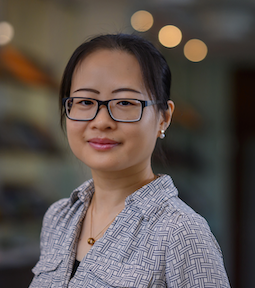
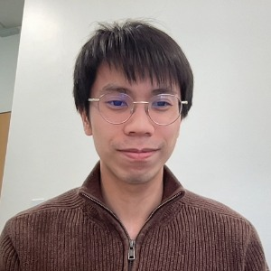

# Our Team

Meet the talented researchers and staff members who make our work possible.

  

    
    <h3>Dr. Na Sun</h3>
    
Principal Investigator / AI Whitehead Fellow

    
Sun earned an S.B. in Life Science at Linyi University in 2009, then completed an S.M. in Bioinformatics and Developmental Biology at the University of the Chinese Academy of Sciences in 2013. She conducted her master’s research in the lab of Jing-Dong Han, and continued as a research associate in the Han lab until 2016. In 2017, Sun came to Cambridge to work as a bioinformatics specialist at the Ragon Institute of MGH, MIT and Harvard. In 2020, Sun embarked on graduate studies on computational biology at MIT and earned a PhD in Computer Science in 2024. Sun joined Whitehead Institute as its inaugural AI Fellow in 2024.

    
<strong>Email:</strong> nasun@wi.mit.edu

    
<strong>Publications:</strong> <a href="https://scholar.google.com/citations?user=oOxS8vwAAAAJ">Google Scholar</a>

  

  
  

    
    <h3>Ms. Sophia Davenport</h3>
    
Bioinformatics Technician

    
Specializing in Python, R and large-scale data analysis.

    
<strong>Email:</strong> sdavenport@wi.mit.edu

    
<strong>Codes:</strong> <a href="https://github.com/sophiadavenport">GitHub</a>

  

  

    
    <h3>Mr. Albert Hung</h3>
    
Research Assistant

    

    
<strong>Email:</strong> azhung@wi.mit.edu

    
<strong></a>

  

  

    
    <h3>Mr. Yan Cui</h3>
    
Research Intern

    

    
<strong>Email:</strong> ycui@wi.mit.edu

    
<strong></a>

  

## Join Our Team

We are always looking for passionate and talented individuals to join our research group. 
If interested, please contact Dr. Sun with your CV and a brief statement of research interests.
